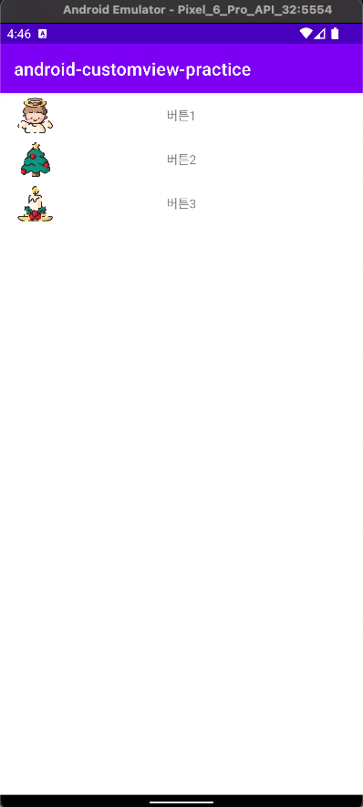

# 커스텀 뷰(Custom View)
- ------
더 자세한 정리는 [여기](https://spicy-spandex-e82.notion.site/Custom-View-af3aeb18c15240d9ae90e2172d464828) 를 참고해주세요.




커스텀 뷰를 정의하려면 커스텀 속성을 선언해줘야한다.

xml 요소를 통해 View를 제어하기 위해 attrs.xml 파일을 만들어 <declare-styleable> 요소를 추가한다.

```xml
<resources>
    <declare-styleable name="CustomLoginButton">
        <attr name="symbol" format="string|reference" />
        <attr name="text" format="string" />
    </declare-styleable>
</resources>
```
속성을 정의하면 안드로이드 기본 위젯처럼 XML에서 사용이 가능하다.
```xml
<com.jiwondev.android_customview_practice.CustomLoginButton
    android:layout_width="match_parent"
    android:layout_height="50dp"
    app:layout_constraintEnd_toEndOf="parent"
    app:layout_constraintStart_toStartOf="parent"
    app:layout_constraintTop_toTopOf="parent"
    app:symbol="😀"
    app:text="hi?" />
```
그 이후 커스텀 뷰 클래스를 만들어주면 된다.
```kotlin
class CustomLoginButton constructor(
    context: Context,
    attrs: AttributeSet,
) : ConstraintLayout(context, attrs) {
    private val binding: CustomLoginButtonBinding =
        CustomLoginButtonBinding.inflate(LayoutInflater.from(context), this, true)

    init {
        val typedArray = context.obtainStyledAttributes(attrs, R.styleable.CustomLoginButton)

        val text = typedArray.getString(R.styleable.CustomLoginButton_text)
        binding.title.text = text

        val symbol = typedArray.getResourceId(
            R.styleable.CustomLoginButton_symbol,
            R.drawable.ic_launcher_foreground
        )
        Glide.with(this).load(symbol).into(binding.symbol)

        typedArray.recycle()
    }

    override fun onDraw(canvas: Canvas?) {
        super.onDraw(canvas)
        Log.d(TAG, "onDraw")
    }

    override fun onMeasure(widthMeasureSpec: Int, heightMeasureSpec: Int) {
        super.onMeasure(widthMeasureSpec, heightMeasureSpec)
        Log.d(TAG, "onMeasure 파라미터 값 테스트")
        val widthMode = MeasureSpec.getMode(widthMeasureSpec)
        val widthSize = MeasureSpec.getSize(widthMeasureSpec)
        val heightMode = MeasureSpec.getMode(heightMeasureSpec)
        val heightSize = MeasureSpec.getSize(heightMeasureSpec)
        Log.d("widthMode : ", widthMode.toString())
        Log.d("widthSize : ", widthSize.toString())
        Log.d("heightMode : ", heightMode.toString())
        Log.d("heightSize : ", heightSize.toString())
    }

    override fun onLayout(changed: Boolean, left: Int, top: Int, right: Int, bottom: Int) {
        super.onLayout(changed, left, top, right, bottom)
        Log.d(TAG, "onLayout 파라미터 값 테스트")
        Log.d("left : ", left.toString())
        Log.d("right : ", right.toString())
        Log.d("top : ", top.toString())
        Log.d("bottom : ", bottom.toString())
    }

    override fun onKeyDown(keyCode: Int, event: KeyEvent?): Boolean {
        Log.d(TAG, "onKeyDown")
        return super.onKeyDown(keyCode, event)
    }

    override fun onAttachedToWindow() {
        super.onAttachedToWindow()
        Log.d(TAG, "onAttachedToWindow")
    }

    override fun onFinishInflate() {
        super.onFinishInflate()
        Log.d(TAG, "onFinishInflate")
    }
}
```
- AttributeSet : XML로 뷰를 만들때, XML로 정의된 태그 데이터들이 AttributeSet 형태로 데이터가 전달됨
- typedArray로 설정해놓은 값에 참조가 가능하다.
- typedArray는 공유객체이기 때문에 사용후 반드시 `recycle()` 해줘야 한다.

onDraw() , onMeasure() , onLayout() 이 3가지 오버라이드 메서드에서 원하는대로 커스텀 해주는 작업은

View의 기능을 잘 이해해야 사용이 가능할 것 같다. 


